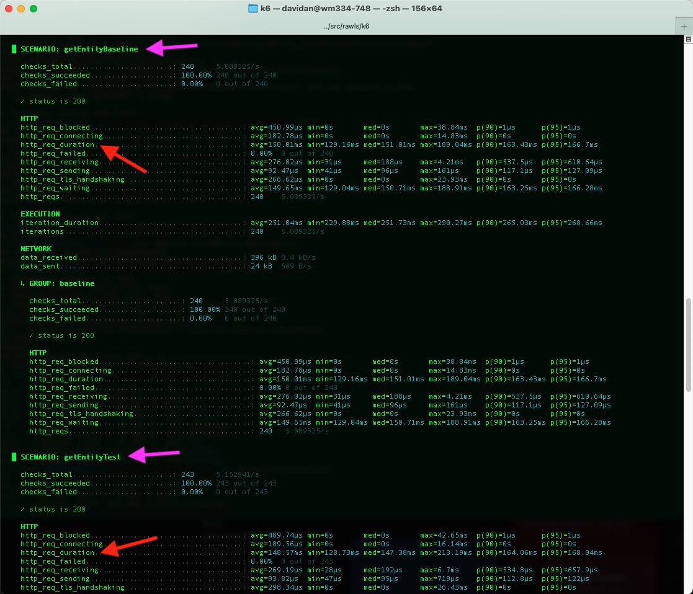

# Quicksilver Data Tables Performance Testing

## Quick Start

* install k6: `brew install k6`
* edit `quicksilver.env` as appropriate for your test
* `source quicksilver.env`
* `gcloud auth login` as a user with access to the workspaces under test
* `QUICKSILVER_USER_TOKEN=$(gcloud auth print-access-token) k6 run --summary-mode=full quicksilver.js`

## k6

These performance tests use the `k6` framework. For details on installing k6,
see https://grafana.com/docs/k6/latest/set-up/install-k6/.

Once installed, execute `k6 run --help` for options on running tests.

## Interpreting Results

The `--summary-mode=full` output from the k6 test run shows timing per _scenario_. You can view the
scenario definitions inside `quicksilver.js`; they are named intuitively. Compare the timings for
the "test" and "baseline" scenarios to look for any notable differences.

_example output:_

